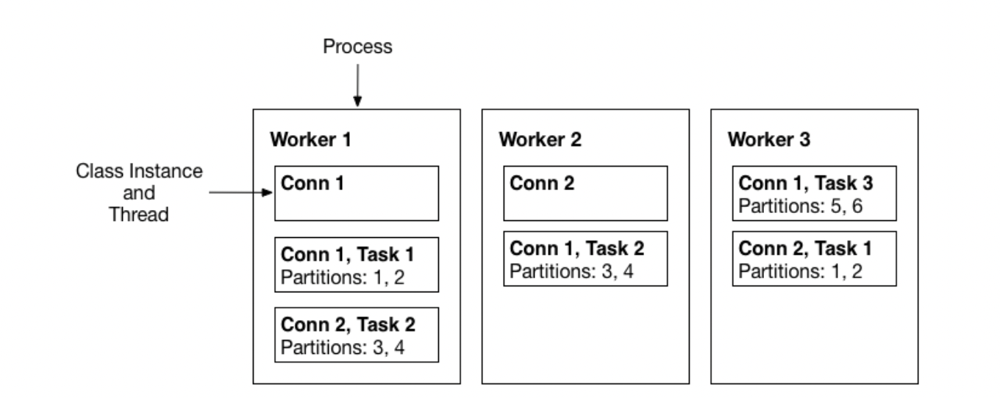

## Issue
- Kafka connect 용어 정리가 필요하다.  
    - task ?   
    - worker ?  
    - client ?  
- client.id는 어디서 받아오는 것인지 ?  
- 운영 중 worker rebalancing 이 중요한 메트릭으로 작용하는지 ? 해당 메트릭 모니터링 필요한지 ?  

## Diagram


```
##(1)connect process
$ ps -ef | grep dist
kafka    19231     1  7  5월24 ?      1-12:42:55 java -Xms256M -Xmx2G -server... /kafka/config/connect-distributed.properties
```
```
##(2)connector
$ curl rhsc:8083/connectors | jq 
[ "debezium-SR", "datagen-SR"]
```
```
##(3)task 
$ curl rhsc:8083/connectors/debezium-SR/status | jq
{
  "name": "debezium-SR",
  "connector": {
    "state": "RUNNING",
    "worker_id": "rhsc2:8083"
  },
  "tasks": [
    {
      "id": 0,
      "state": "RUNNING",
      "worker_id": "rhsc2:8083"
    }
  ],
  "type": "source"
}
```
- Kafka Connect Concepts  
    - `Workers` : Kafka Connect의 프로세스를 의미한다. (1)번 예시에 해당한다. 특히 distributed mode에서는 동일한 group.id를 사용하여 많은 worker process를 시작하고, 사용 가능한 모든 worker 에서 connector및 task를 자동으로 조정한다. 이때, 동일한 group.id를 갖는 worker는 동일한 클러스터 내에 있는 것이다.  
    ```
    If you add a worker, shut down a worker, or a worker fails unexpectedly, the rest of the workers detect this and automatically coordinate to redistribute connectors and tasks across the updated set of available workers. Note the similarity to consumer group rebalance. Under the covers, connect workers are using consumer groups to coordinate and rebalance.
    ```
    - Connectors : json 파일로 생성한 인스턴스이다. (2)번 예시에 해당한다. 한편 카프카 월드에서 “커넥터 설치"는 플러그인을 나타내고, “커넥터의 상태 확인"은 커넥터 인스턴스를 나타낸다.  
    ```
    Connectors in Kafka Connect define where data should be copied to and from. A connector instance is a logical job that is responsible for managing the copying of data between Kafka and another system. All of the classes that implement or are used by a connector are defined in a connector plugin. Both connector instances and connector plugins may be referred to as “connectors”, but it should always be clear from the context which is being referred to (for example, “install a connector” refers to the plugin, and “check the status of a connector” refers to a connector instance).
    ```
    - Tasks : 실제로 데이터를 복사하는 작업을 수행하는 인스턴스 이다. (3)번 예시에 해당한다.  
    ```
    Tasks are the main actor in the data model for Connect. Each connector instance coordinates a set of tasks that actually copy the data. By allowing the connector to break a single job into many tasks, Kafka Connect provides built-in support for parallelism and scalable data copying with very little configuration. These tasks have no state stored within them. Task state is stored in Kafka in special topics config.storage.topic and status.storage.topic
    and managed by the associated connector. As such, tasks may be started, stopped, or restarted at any time in order to provide a resilient, scalable data pipeline.
    ```
    - Client : 각 task에 대하여 kafka connect 프레임워크에 의해 생성되는 내부 프로듀서 혹은 컨슈머이다.  
- client.id 는 connector 이름을 기반으로 kafka connect 프레임워크에 의해 설정된다.  
    - free text를 허용하는 구성으로, 기본값은 빈 문자열이다. 비어있는 경우, kafka connect는 이를 “connect-X”로 설정한다. 이때 X는 임의의 정수이지만, 일반적으로 1로 설정된다.  
    - client.id에 대하여 요구되는 사항은 없다.  

- worker rebalancing은 브로커와 kafka connect 노드 간의 연결이 불안정함을 의미한다. 이러한 일이 발생하면 커넥터가 작동하지 않는다. 굳이 모니터링할 필요는 없을 것 같다.
  
## Ref
https://docs.confluent.io/platform/current/connect/index.html