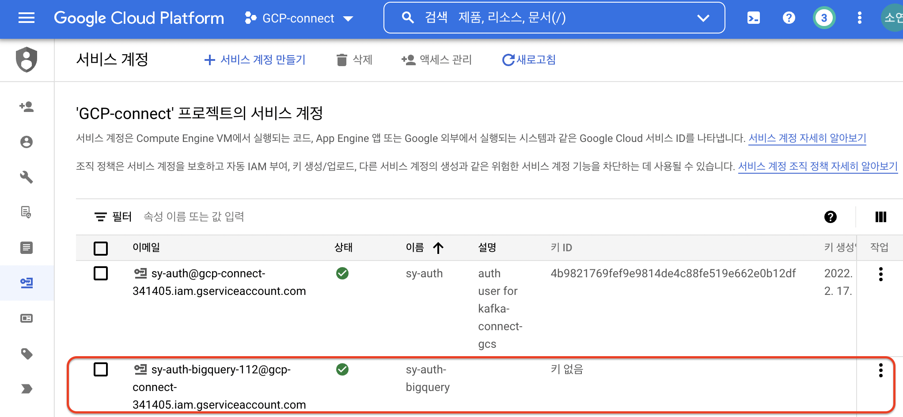

## 목차  
1. Requirements   
    1. Google key 받기  
    2. BigQuery dataset 생성  
    3. BigQeury API 활성화  
2. Confluent  
    1. General configuration   
---

Kafka Connect Google BigQuery Sink 커넥터는 데이터를 BigQuery 테이블로 스트리밍하는데 사용된다.  
등록된 스키마가 있는 토픽을 스트리밍할 때, 싱크 커넥터는 적절한 빅쿼리 테이블 스키마를 생성할 수 있다. 빅쿼리 테이블 스키마는 주제에 대한 카프카 스키마의 정보를 기반으로 한다.  

# Requirements

### 1. Google key 받기
1. 메뉴에서 `IAM 및 관리자 > 서비스 계정`을 선택한다.  


2. 해당 서비스 계정에 프로젝트에 대한 엑세스 권한을 부여한다.  
이때 모든 BigQuery의 데이터세트의 모든 콘텐츠를 수정할 수 있는 `Bigquery 데이터 편집자` 권한을 부여한다.  


확인  


3. 키를 생성하고 다운로드 받아준다.  


4. 내려받은 키를 서버로 전송한다.  
```
% scp gcp-connect-341405-ec7ed5d0bcd8.json kafka@10.20.19.66:/home/kafka
```

### 2.  Big Query dataset 생성

1. 메뉴에서 Big Query를 선택하여 데이터를 추가할 수 있다.  


2. 본인의 프로젝트를 선택한다.  


3. 데이터셋을 생성한다.  


### 3. BigQuery API 활성화

메뉴에서 API 및 서비스를 선택하여 빅쿼리 API를 활성화할 수 있다.  


- API 라이브러리에서 BigQuery API를 검색하고 이를 사용 설정한다.  


---

# Confluent
- 10.20.19.66 connector01:8083 에서 진행하였다.  

### General configuration

- 플러그인 설치  
https://www.confluent.io/hub/wepay/kafka-connect-bigquery

```
$ cd /confluent/bin
$ ./confluent-hub install wepay/kafka-connect-bigquery:2.2.2
Do you want to install this into /confluent/share/confluent-hub-components? (yN) y

 
Component's license: 
Apache License 2.0 
https://www.apache.org/licenses/LICENSE-2.0 
I agree to the software license agreement (yN) y

You are about to install 'kafka-connect-bigquery' from WePay, as published on Confluent Hub. 
Do you want to continue? (yN) y

Downloading component BigQuery Sink Connector 2.2.2, provided by WePay from Confluent Hub and installing into /confluent/share/confluent-hub-components 
Detected Worker's configs: 
  1. Standard: /confluent/etc/kafka/connect-distributed.properties 
  2. Standard: /confluent/etc/kafka/connect-standalone.properties 
  3. Standard: /confluent/etc/schema-registry/connect-avro-distributed.properties 
  4. Standard: /confluent/etc/schema-registry/connect-avro-standalone.properties 
  5. Used by Connect process with PID 14988: /confluent/etc/kafka/connect-distributed.properties 
Do you want to update all detected configs? (yN) y

Adding installation directory to plugin path in the following files: 
  /confluent/etc/kafka/connect-distributed.properties 
  /confluent/etc/kafka/connect-standalone.properties 
  /confluent/etc/schema-registry/connect-avro-distributed.properties 
  /confluent/etc/schema-registry/connect-avro-standalone.properties 
  /confluent/etc/kafka/connect-distributed.properties 
 
Completed
```

- connector 서비스 재기동  
```
$ sudo systemctl stop confluent-connector.service
$ sudo systemctl start confluent-connector.service

#플러그인 설치 확인
$ curl connector01:8083/connector-plugins | jq

% Total    % Received % Xferd  Average Speed   Time    Time     Time  Current
                                 Dload  Upload   Total   Spent    Left  Speed
100  1461  100  1461    0     0  76894      0 --:--:-- --:--:-- --:--:-- 76894
[
 {
    "class": "com.wepay.kafka.connect.bigquery.BigQuerySinkConnector",
    "type": "sink",
    "version": "unknown"
  }, ...
]

#이관할 토픽 생성, 데이터 프로듀싱
##Topic create
$ ./kafka-topics --bootstrap-server broker01:9092 --topic sy.test.bigquery.220316 --create

##Produce
% conda activate kaf-py
(kaf-py)% python transaction.py
```

- 커넥터 등록  
```
$ cd /home/kafka/connector_json
$ vi sy-bigquery.json

{
  "name": "sy-bigquery3",
  "config": {
    "connector.class" : "com.wepay.kafka.connect.bigquery.BigQuerySinkConnector",
    "topics" : "sy.test.bigquery.220316",
    "tasks.max" : "1",
    "project": "gcp-connect-341405",
    "defaultDataset": "kafka_bigquery_test_220316",
    "keyfile": "/home/kafka/gcp-connect-341405-ec7ed5d0bcd8.json",
    "sanitizeTopics": "true",
    "sanitizeFieldNames": "true",
    "autoCreateTables": "true",
    "autoUpdateSchemas" : "true",
    "schemaRegistryLocation": "http://sch1:8081",
    "key.converter": "io.confluent.connect.avro.AvroConverter",
    "key.converter.schema.registry.url": "http://sch1:8081",
    "key.converter.basic.auth.credentials.source": "URL",
    "key.converter.schemas.enable": "true",
    "value.converter": "io.confluent.connect.avro.AvroConverter",
    "value.converter.schema.registry.url": "http://sch1:8081",
    "value.converter.basic.auth.credentials.source": "URL",
    "value.converter.schemas.enable": "true"
  }
}
```

- 커넥터 등록
```
$ pwd
/home/kafka/connector_json

curl -X POST -H "Content-Type: application/json" --data @sy-bigquery.json http://connector01:8083/connectors/
```

- BigQuery 확인  
커넥터 실행 결과 토픽 이름과 동일한 테이블이 자동 생성된다.  
sql 쿼리를 사용해 테이블에 이관된 모든 데이터를 조회하고, 확인할 수 있다.  


## reference
https://docs.confluent.io/home/overview.html

Test by Soyoen

