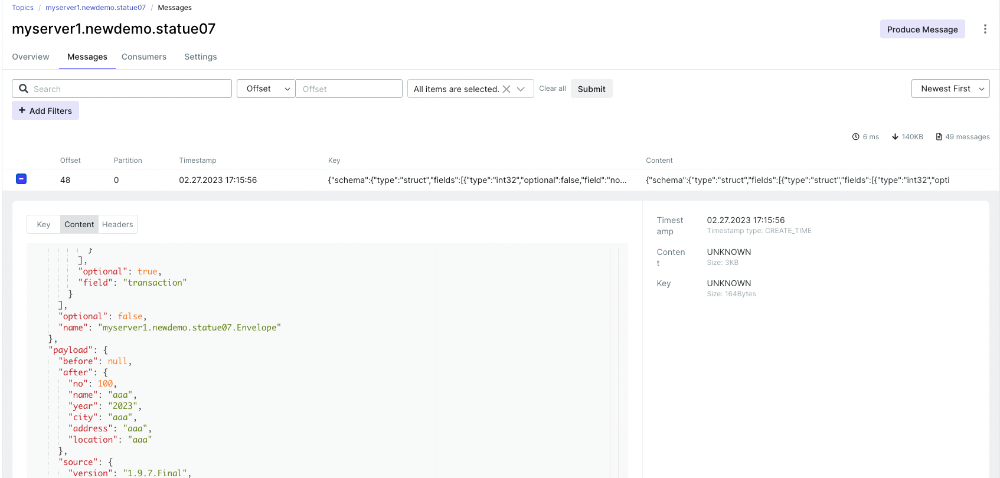

## 테스트 시나리오

**대상** : dist connector (conn1, conn2) 

- running 중인 conn1의 plugin jar를 삭제시 정상 동작하는가?  

# 1. conenctor 정보

- connector 1  
```
$ vi debezium-mysql03.json

{
"name": "debezium-mysql03",
  "config": {
    "connector.class": "io.debezium.connector.mysql.MySqlConnector",
    "key.converter": "org.apache.kafka.connect.json.JsonConverter",
    "key.converter.schemas.enable": "true",
    "value.converter": "org.apache.kafka.connect.json.JsonConverter",
    "value.converter.schemas.enable": "true",
    "tasks.max": "1",
		"database.server.id" : "1",
    "database.hostname": "mysql",
    "database.port": "3306",
    "database.user": "goodus6",
    "database.password": "goodus6",
    "database.server.name": "myserver1",
    "database.allowPublicKeyRetrieval": "true",
    "database.include.list": "newdemo",
    "table.include.list" : "newdemo.statue06, newdemo.statue07",
    "database.history.kafka.bootstrap.servers": "10.20.19.174:9092",
    "database.history.kafka.topic": "dbhistory.newdemo",
    "database.connectionTimeZone" : "Asia/Seoul",
    "include.schema.changes": "true",
		"heartbeat.interval.ms" : "30000"
  }
}

curl -X POST http://wm17:8083/connectors/ -H "Content-Type: application/json" --data @/home/kafka/JSON/debezium-mysql03.json
```
- status (task 분산 확인)  
```
$ curl wm17:8083/connectors/debezium-mysql03/status
{
  "name": "debezium-mysql03",
  "connector": {
    "state": "RUNNING",
    "worker_id": "10.20.19.179:8083"
  },
  "tasks": [
    {
      "id": 0,
      "state": "RUNNING",
      "worker_id": "10.20.19.179:8083"
    }
  ],
  "type": "source"
}
```

# 2. jar 파일 삭제  
- Connector 2 (179)  server에서 jar 파일 삭제(mv)  
```
$ cd ~/kafka_2.13-2.8.2/plugins
$ ls
confluentinc-connect-transforms-1.4.2            confluentinc-kafka-connect-jdbc-10.4.1  kafka-connect-datagen-0.5.3
confluentinc-kafka-connect-avro-converter-7.0.1  confluentinc-kafka-connect-jdbc-10.5.0  mongo-source-sink
confluentinc-kafka-connect-datagen-0.5.3         debezium-connector-mysql                wepay-kafka-connect-bigquery-2.3.4

$ mv debezium-connector-mysql ../../
```
- 상태 확인  
```
$ curl wm18:8083/connectors/debezium-mysql03/status  | jq
  % Total    % Received % Xferd  Average Speed   Time    Time     Time  Current
                                 Dload  Upload   Total   Spent    Left  Speed
100   176  100   176    0     0   8000      0 --:--:-- --:--:-- --:--:--  8380
{
  "name": "debezium-mysql03",
  "connector": {
    "state": "RUNNING",
    "worker_id": "10.20.19.179:8083"
  },
  "tasks": [
    {
      "id": 0,
      "state": "RUNNING",
      "worker_id": "10.20.19.179:8083"
    }
  ],
  "type": "source"
} 
```
- 데이터 삽입  
```
mysql> insert into statue07 values (100,"aaa","2023","aaa","aaa","aaa");
Query OK, 1 row affected (0.02 sec)
```


- plugin 확인  
```
kafka@wm17:~/kafka_2.13-2.8.2/logs$ curl wm17:8083/connector-plugins | jq
  % Total    % Received % Xferd  Average Speed   Time    Time     Time  Current
                                 Dload  Upload   Total   Spent    Left  Speed
100  1335  100  1335    0     0   108k      0 --:--:-- --:--:-- --:--:--  108k
...
  {
    "class": "io.debezium.connector.mysql.MySqlConnector",
    "type": "source",
    "version": "1.9.7.Final"
  },
  {
...
```
→ worker가 올라온 후, jar 파일의 분실은 커넥터에 영향을 주지 않는다.    
→ plugin을 읽는 것은, 커넥터와 워커가 start할 때로 jvm에 올라감  


